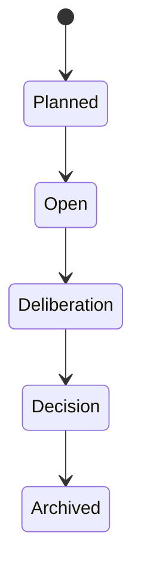

# Machine d'état globale — UCKK-A014

Ce document est la source de vérité temporelle de la démo.

Les autres documents ne doivent pas redéfinir les états T-14, T-7, T0, J3, J30 et J90.

---

## 1. Horloge virtuelle

```text
T-14
T-7
T0-pre
T0-post
J3
J30
J90
R1
```

Le sandbox peut avancer instantanément entre ces points.

---

## 2. Tableau maître

| État | UCKK | Konnaxion | Orgo | UCKK-Moodle | Transition autorisée |
|---|---|---|---|---|---|
| `T-14` | A014 ouverte; aucune décision | Topic ouvert; arguments actifs | aucun Case A014 | matériel de pilote non actif | contributions |
| `T-7` | A014 en délibération | arguments + baseline + lecture Smart Vote | aucun Case A014 | matériel non actif | convoquer Assemblée |
| `T0-pre` | Assemblée ouverte; décision absente | délibération figée pour décision | aucun Case A014 | matériel non actif | décision humaine |
| `T0-post` | D009 publiée | baseline/reading conservées | Signal reçu; orchestration possible | pilote autorisé | simulate/execute |
| `J3` | D009 inchangée | impact initial facultatif | Case actif | équipes/chartes actives | observation J3 |
| `J30` | D009 inchangée | impact J30 publié | incidents + Tasks + publish op | observations agrégées | review |
| `J90` | reconsidération due | dossier final + follow-up prêt | Case peut être résolu/maintenu | preuves agrégées | ouvrir R1 |
| `R1` | prochaine décision non prise | nouvelle délibération | ancien Case reste historique | pilote reste sous mandat existant | nouvelle Assemblée |

---

## 3. Invariant d'existence du Case

```text
T-14   Case A014 MUST NOT EXIST
T-7    Case A014 MUST NOT EXIST
T0-pre Case A014 MUST NOT EXIST
T0-post Case MAY EXIST only after Signal processing
```

Test critique :

```text
Smart Vote generated
→ assert no Orgo Case
```

---

## 4. Invariant d'autorité

```text
T-14 .. T0-pre
authoritative decision = none

T0-post .. R1
authoritative decision = UCKK-D009
until superseded by a later Assembly decision
```

Les observations J3/J30/J90 ne changent pas cet invariant.

---

## 5. Machine UCKK



Pour la fixture :

```text
T-14   Open
T-7    Deliberation
T0-pre Deliberation
T0-post Decision
J3     Decision
J30    Decision
J90    Decision + reconsideration_due
R1     nouvelle motion/topic, D009 toujours historique
```

`SOURCE_CANON` : les états Assembly documentés sont `planned → open → deliberation → decision → archived`.

---

## 6. Machine Konnaxion de démo

`DEMO_CONTRACT_V1`

La démo n'impose pas une nouvelle machine métier Konnaxion; elle utilise une projection de présentation :

```text
OPEN
→ DELIBERATING
→ DECISION_INPUT_FROZEN
→ ACCOUNTABILITY
→ FOLLOWUP_OPEN
```

Ces labels ne doivent pas être confondus avec des statuts backend existants si ceux-ci diffèrent.

---

## 7. Machine Orgo — Signal

`IMPLEMENTED_ORGO`

Invariant :

```text
normalize
→ deduplicate/idempotency check
→ persist Signal
→ workflow/orchestration evaluation
```

Le Signal est accepté avant les effets retry-prone.

Projection démo :

```text
RECEIVED
→ PROCESSING
→ PROCESSED
```

Le statut réel doit être celui du runtime actif; la fixture ne doit pas inventer un enum si le code diffère.

---

## 8. Machine Orgo — Case

`SOURCE_CANON`

```text
open
 ├→ in_progress
 ├→ resolved
 └→ archived

in_progress
 ├→ resolved
 └→ archived

resolved
 ├→ in_progress
 └→ archived

archived → terminal
```

Projection A014 :

```text
T0-post open
J3      in_progress
J30     in_progress
J90     resolved OR in_progress
```

Ne pas archiver à J90 si le travail de reconsidération doit rester dans le même contexte opérationnel.

---

## 9. Machine Orgo — Task

`SOURCE_CANON`

```text
Pending
→ In progress
→ Completed / Failed / Escalated

Pending / On hold
→ Cancelled when appropriate
```

Les Tasks reflètent uniquement le travail.

```text
Task completed
≠ institutional policy approved
```

---

## 10. IntegrationOperation

`IMPLEMENTED_ORGO`

Projection :

```text
QUEUED
→ RUNNING
→ SUCCEEDED

RUNNING
→ FAILED / retry
```

Le bridge peut retourner :

```text
accepted
```

sans rendre l'opération terminale.

Invariant :

```text
accepted ≠ succeeded
succeeded ≠ business approval
```

---

## 11. Transitions de démo

### Transition `T-14 → T-7`

Préconditions :

```text
A014 existe
Topic Konnaxion existe
arguments minimum seedés
```

Effet :

```text
baseline disponible
Smart Vote advisory disponible
```

Aucun effet Orgo.

### Transition `T-7 → T0-pre`

Effet :

```text
version de lecture figée pour la séance
```

Aucun Case.

### Transition `T0-pre → T0-post`

Action humaine :

```text
publier UCKK-D009
```

Puis :

```text
adapter UCKK→Orgo
POST /signals
```

### Transition `T0-post → J3`

Précondition :

```text
Signal processed
Case exists
workflow pinned
```

Injecter fixture J3.

### Transition `J3 → J30`

Injecter fixture J30.

Orgo peut créer du nouveau Work.

### Transition `J30 → J90`

Publier impact J30 via IntegrationOperation.

Injecter fixture J90.

### Transition `J90 → R1`

Ouvrir Topic Konnaxion A014-R1.

Ne pas prendre automatiquement une nouvelle décision UCKK.

---

## 12. Réversibilité

`Reset Sandbox` doit revenir à :

```text
T-14
```

avec :

```text
A014 ouverte
D009 non publiée
Konnaxion Topic ouvert
baseline/reading seedées selon état
aucun Case Orgo A014
aucune publication Impact
follow-up R1 caché
```

Le reset est défini dans `05_SEEDS_FIXTURES.md`.
