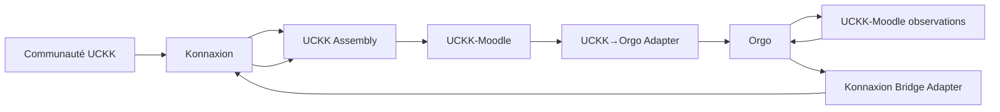
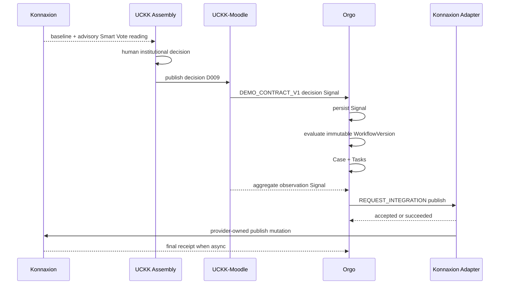

# Architecture et contrats

Ce document est la source de vérité de la vertical slice pour les flux inter-systèmes.

---

## 1. Architecture



---

## 2. Statut des quatre ponts

| Pont | Statut | Usage v2 |
|---|---|---|
| Konnaxion → UCKK Smart Vote | `SOURCE_CANON` / intégration Moodle documentée, validation runtime à confirmer | peut être seedé |
| UCKK decision → Orgo Signal | `DEMO_CONTRACT_V1` | **live obligatoire** |
| UCKK-Moodle observation → Orgo Signal | `DEMO_CONTRACT_V1` | fixture-injecté acceptable |
| Orgo → Konnaxion publish | protocole Orgo `IMPLEMENTED_ORGO`; provider Konnaxion `NO_ACTIVE_ADAPTER` | **adapter démo à construire** |

---

## 3. Flux d'autorité



---

# PARTIE A — Contrats existants Orgo

## 4. Signal

`IMPLEMENTED_ORGO`

Champs logiques documentés :

```text
id
organization_id
source
external_reference
idempotency_key
type / classification / severity
title / description
payload or payload_ref
received_at
processed_at
status
```

Invariant :

```text
normalize
→ deduplicate
→ persist Signal
→ workflow evaluation
```

Un Signal :

```text
MAY create Case
MAY enrich existing Case
MAY create Tasks through workflow
MUST NOT be treated as Task by identity
```

---

## 5. Intake HTTP

`IMPLEMENTED_ORGO`

Le snapshot documente :

```http
POST /signals
```

Le Signal est persisté et, si demandé, un message d'outbox peut référencer une version immuable de workflow.

La vertical slice **ne crée pas** un endpoint parallèle `/api/v3/signals` tant que le runtime actif ne le requiert pas.

---

## 6. Workflow actions

`IMPLEMENTED_ORGO`

Actions décrites comme supportées :

```text
CREATE_CASE
CREATE_TASK
UPDATE_TASK
ASSIGN_TASK
ROUTE
ESCALATE
SET_METADATA
ATTACH_TEMPLATE
ADD_LABEL
NOTIFY
REQUEST_INTEGRATION
```

Références :

```text
$signal.id
$signal.source
$signal.title
$signal.description
$signal.label
$signal.type
$signal.category
$signal.severity
$signal.payload
$case
$task
```

---

## 7. Simulation

`IMPLEMENTED_ORGO`

```text
same input + same rules
→ same resolved actions
→ no mutation in simulation mode
```

La simulation :

```text
returns intents
does not execute handlers
does not promise external success
```

---

## 8. Effets externes durables

`IMPLEMENTED_ORGO`

```text
business mutation
+ OutboxMessage
        ↓ same transaction
commit
        ↓
worker
        ↓
provider adapter
        ↓
receipt / retry / failure
```

---

## 9. IntegrationOperation

`IMPLEMENTED_ORGO`

Séparée du Case/Task.

Champs documentés :

```text
organization_id
provider
operation
subject_type / subject_id
external_reference
status
idempotency_key
correlation_id
request metadata
receipt/error
started_at / completed_at
```

Invariant :

```text
external publication status
≠ Case.status
```

---

## 10. Bridge Konnaxion côté Orgo

`IMPLEMENTED_ORGO` pour le protocole Orgo-owned.  
`NO_ACTIVE_ADAPTER` côté Konnaxion actuel.

Configuration :

```text
KONNAXION_BRIDGE_URL
KONNAXION_BRIDGE_TOKEN (optionnel selon env)
```

Opérations allowlist documentées :

```text
publish
distribute
```

Envelope :

```json
{
  "operation_id": "uuid",
  "organization_id": "uuid",
  "operation": "publish",
  "idempotency_key": "organization-uuid:operation-uuid",
  "correlation_id": "correlation",
  "subject": {
    "type": "case",
    "id": "uuid"
  },
  "input": {}
}
```

Réponses :

```json
{
  "status": "succeeded",
  "external_reference": "provider-owned-reference",
  "data": {}
}
```

ou :

```json
{
  "status": "accepted",
  "external_reference": "provider-owned-reference",
  "data": {}
}
```

Si `accepted` :

```http
POST /api/v3/integration-operations/:id/receipt
```

avec callback authentifié et idempotent.

---

# PARTIE B — Contrats de démo proposés

## 11. Decision → Signal v1

`DEMO_CONTRACT_V1`

Identité :

```text
external_reference
= uckk:assembly:A014:decision:D009:v1

correlation_id
= corr:uckk:A014:D009
```

Payload normalisé :

```json
{
  "source": "API",
  "external_reference": "uckk:assembly:A014:decision:D009:v1",
  "type": "education_pilot_approved",
  "classification": "institutional_decision",
  "severity": "MODERATE",
  "title": "Implement UCKK Pedagogical Pilot A014",
  "description": "UCKK Assembly published decision D009.",
  "payload": {
    "authority": {
      "system": "uckk",
      "authority_type": "human_institutional_decision",
      "assembly_ref": "UCKK-A014",
      "decision_ref": "UCKK-D009",
      "decision_status": "published",
      "outcome": "approved_with_conditions"
    },
    "mandate": {
      "course_sections": 3,
      "team_size": {
        "min": 4,
        "max": 6
      },
      "sprint_weeks": 2,
      "rotating_roles": true,
      "contribution_journaling": true,
      "evaluation_model": {
        "individual": 0.50,
        "peer_engagement": 0.30,
        "traced_contribution": 0.20
      },
      "review_days": [3, 30, 90]
    },
    "deliberation_refs": {
      "konnaxion_topic": "ethikos-topic:UCKK-A014",
      "baseline": "baseline:UCKK-A014:v1",
      "smart_vote": "sv:UCKK-A014:v1",
      "smart_vote_authority": "computed_reading_only"
    },
    "archive_ref": "UCKK-ARCH-A014-D009"
  }
}
```

Headers recommandés :

```http
Idempotency-Key: uckk:A014:D009:v1
X-Correlation-ID: corr:uckk:A014:D009
```

Si le runtime Orgo actif utilise un autre nom de header, aligner sur `API_IMPLEMENTED.md`.

---

## 12. Workflow A014

`DEMO_CONTRACT_V1`, utilisant le vocabulaire d'action Orgo existant.

```json
{
  "rules": [
    {
      "id": "uckk_pedagogy_pilot_approved_v1",
      "enabled": true,
      "match": {
        "source": "API",
        "type": "education_pilot_approved"
      },
      "actions": [
        {
          "type": "CREATE_CASE",
          "target": "$signal",
          "input": {
            "title": "$signal.title",
            "description": "$signal.description"
          }
        },
        {
          "type": "SET_METADATA",
          "target": "$case",
          "input": {
            "demo_code": "UCKK-A014",
            "authority": "$signal.payload"
          }
        },
        {
          "type": "CREATE_TASK",
          "target": "$case",
          "input": {
            "title": "Freeze approved pilot specification"
          }
        },
        {
          "type": "CREATE_TASK",
          "target": "$case",
          "input": {
            "title": "Verify Day-3 team formation and charters"
          }
        },
        {
          "type": "CREATE_TASK",
          "target": "$case",
          "input": {
            "title": "Produce Day-30 process review"
          }
        },
        {
          "type": "CREATE_TASK",
          "target": "$case",
          "input": {
            "title": "Produce Day-90 reconsideration package"
          }
        }
      ]
    }
  ]
}
```

**Important :** valider les champs exacts `input` contre le runtime Orgo actif avant import. Le vocabulaire d'action est soutenu; les détails de payload constituent la fixture.

---

## 13. Observation J30 → Signal

`DEMO_CONTRACT_V1` + `SYNTHETIC_FIXTURE`

```json
{
  "source": "API",
  "external_reference": "uckk:pilot:A014:observation:day30:v1",
  "type": "education_pilot_observation",
  "classification": "checkpoint_observation",
  "severity": "MODERATE",
  "title": "Day-30 observations — UCKK A014",
  "payload": {
    "checkpoint": "day_30",
    "epistemic_status": "synthetic_demo_fixture",
    "observations": [
      {
        "code": "workload_imbalance",
        "count": 6
      },
      {
        "code": "peer_rubric_clarification",
        "count": 2
      }
    ],
    "contains_personal_data": false,
    "authority": "observation_only",
    "source_system": "uckk-moodle"
  }
}
```

---

## 14. Orgo → Konnaxion Impact

Outer envelope : `IMPLEMENTED_ORGO`.  
`input` : `DEMO_CONTRACT_V1`.

```json
{
  "operation_id": "<orgo-uuid>",
  "organization_id": "<uckk-org-uuid>",
  "operation": "publish",
  "idempotency_key": "<org-uuid>:<operation-uuid>",
  "correlation_id": "corr:uckk:A014:D009",
  "subject": {
    "type": "case",
    "id": "<case-uuid>"
  },
  "input": {
    "schema": "konnaxion.impact-update.demo.v1",
    "topic_ref": "ethikos-topic:UCKK-A014",
    "stage": "day_30",
    "title": "Day-30 implementation review",
    "epistemic_status": "synthetic_demo_fixture",
    "summary": "Pilot active; workload imbalance and rubric clarification require follow-up.",
    "authority": "accountability_update_only"
  }
}
```

---

## 15. Provider-side Konnaxion adapter

`NO_ACTIVE_ADAPTER` → à construire pour la démo.

Il doit :

```text
authenticate request
validate Orgo bridge envelope
check operation allowlist
deduplicate operation_id
validate impact input schema
resolve topic_ref
call Konnaxion-owned service
return accepted/succeeded/failed
preserve external_reference
never mutate Orgo
never bypass Konnaxion authorization
```

---

## 16. Idempotence

### UCKK → Orgo

```text
same decision + same idempotency key
→ same Signal outcome
→ no duplicate Case/Task business effect
```

### Orgo → Konnaxion

```text
same operation_id
→ same provider result
→ one Impact artifact
```

---

## 17. Failure semantics

### Konnaxion indisponible

```text
Orgo Case remains valid
Tasks remain valid
IntegrationOperation incomplete
no fake publication
retry/redrive according to Orgo policy
```

### Orgo indisponible

```text
UCKK-D009 remains authoritative
handoff may retry
idempotency prevents duplication
```

### Konnaxion reading absent

```text
UCKK Assembly may still operate
no fake Smart Vote reading
```

---

## 18. Trace

La démo utilise :

```text
corr:uckk:A014:D009
```

Visible dans :

```text
UCKK decision metadata
Orgo Signal
Orgo Case metadata
IntegrationOperation
Konnaxion Impact
demo trace panel
```
